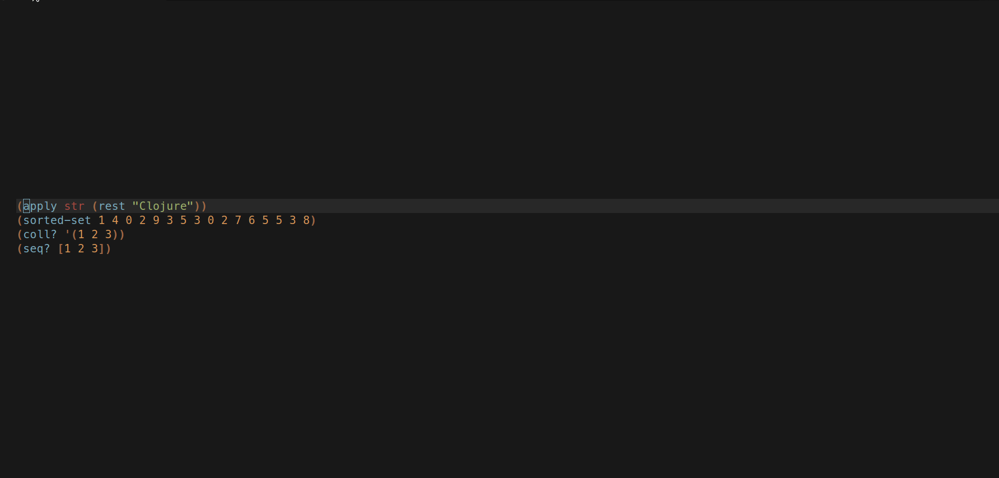

# lispdocs.nvim

View community usage examples/notes from within your editor.




## Installation

Note: This plugin will only work on neovim 0.5.

```vim
Plug 'olical/conjure'
Plug 'kkharji/sqlite.lua'
Plug 'kkharji/lispdocs.nvim' " its a filetype plugin so no need to do any extra work.
```

Mappings:

- `<leader>hh` open a float
- `<leader>hv` open vsplit
- `<leader>hs` open split
- `<leader>hn` open in the current window
- `<leader>hf` launch telescope symbol finder
- `<leader>h<space>` launch telescope symbol finder

Options:

disable default mappings: `let g:lispdocs_mappings = 0`

## API

`lispdocs` functions takes a dict defining the following.

- `opts.display`: which display type to use, "vsplit", "float", "split". o
- `opts.win`: float options (look at vim.w), most notably `winhl` which the background highlighting and `winblend` for transparency
- `opts.symbol`: The symbol to search for.
- `opts.fill`: How much the float window should cover, default 80% or as the option expect `0.8` .
- `opts.border`: the float window chars, see default `["─" "│" "╭" "╮" "╰" "╯"]`.
- `opts.buf`: buffer specific options, applies to all display types, (see vim.bo).

Examples:

```vim
nnoremap <leader><cr> :lua require'lispdocs'.float{ fill = 0.5, win = { winblend = 0, :cursorline false }}<cr>
nnoremap <leader>clojure :lua require'lispdocs'.split{ buf = {ft = "clojure"}}<cr> " bad idea
```

## Someday

- [X] Create a fuzzy finder with telescope.nvim
- [ ] Enable navigation between symbol docs through `See Also` section.
- [ ] Print to conjure float buffer if a symbol is not found
- [ ] support ClojureScript
- [ ] support hy
- [ ] support janet
